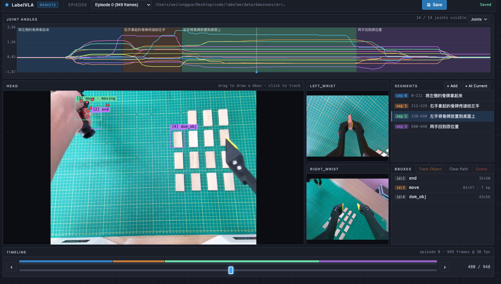

# LabelVLA

**An Annotation Tool for VLA Tasks**

[](https://pypi.org/project/labelvla/)
[](https://pypi.org/project/labelvla/)

[中文](README_ZH.md)

<div align="center">
  
  
  <p><i>LabelVLA desktop annotation interface</i></p>
  
  <p><i>LabelVLA remote (browser) annotation interface — UE-blueprint dark theme</i></p>
</div>

## Why LabelVLA?

VLA (Vision-Language-Action) is a vision-centric paradigm for robotic manipulation tasks. Unlike traditional image/video annotation, VLA data has unique characteristics:

- **Multi-modal time-series data**: includes multi-camera video streams, robot joint angle sequences, end-effector poses, and more
- **Episode-based organization**: each episode represents a complete manipulation procedure
- **Temporal annotation**: requires segmenting the timeline into semantic segments rather than frame-by-frame labeling

There is currently no annotation tool purpose-built for VLA data. LabelVLA fills this gap with native support for the LeRobot v2.1 format and a timeline-centric annotation interface.

## Features

- **Native LeRobot v2.1 format support** — directly reads parquet + mp4 data with no format conversion
- **Multi-camera view** — simultaneously displays head camera (large) and left/right wrist cameras (side panels)
- **Joint angle curve visualization** — plots all joint angles over time with per-joint toggle checkboxes
- **Timeline segment annotation** — divide the timeline into segments, each with a text description
- **BBox annotation** — draw bounding boxes on the head camera view; boxes automatically propagate to all frames within the same segment
- **Moving object tracking** — for objects that move within a segment, click on different frames to set keypoints; the system interpolates the motion path automatically
- **Persistent annotations** — saved as JSON files in the `segments/` folder under the dataset directory
- **Remote annotation mode** — `labelvla_rs` launches a FastAPI + browser UI so you can annotate datasets that live on a headless server

## Supported Data Format

LabelVLA supports the standard [LeRobot v2.1](https://github.com/huggingface/lerobot) directory structure:

```
dataset_folder/
├── meta/
│   ├── info.json            # Dataset metadata (fps, features, camera list, etc.)
│   ├── episodes.jsonl       # Frame count per episode
│   └── tasks.jsonl          # Task descriptions
├── data/
│   └── chunk-000/
│       ├── episode_000000.parquet   # Joint angles, velocity, actions, etc.
│       ├── episode_000001.parquet
│       └── ...
└── videos/
    └── chunk-000/
        ├── observation.images.head/
        │   ├── episode_000000.mp4
        │   └── ...
        ├── observation.images.left_wrist/
        │   └── ...
        └── observation.images.right_wrist/
            └── ...
```

## Installation

### Via pip

```bash
pip install labelvla

# Launch
labelvla
```

### From source

```bash
git clone https://github.com/Kingdroper/labelVLA.git
cd labelVLA

# Using uv (recommended)
uv sync
uv run labelvla

# Or using pip
pip install -e .
labelvla
```

### Dependencies

- Python >= 3.10
- PyQt5
- OpenCV (`opencv-python`)
- pandas + pyarrow
- matplotlib
- See `pyproject.toml` for the full list

## Quick Start

### Step 1: Launch the application

```bash
labelvla
# or
uv run labelvla
```

### Step 2: Open a LeRobot dataset

Click the **LeRobot** button in the toolbar or **File** menu, then select the dataset folder (the directory containing `meta/info.json`).

### Step 3: Browse data

The LeRobot annotation window opens:

```
┌─────────────────────────────────────────────────┐
│ Episode: [dropdown ▼]                    [Save]  │
├─────────────────────────────────────────────────┤
│  Joint angle curves (toggle individual joints)   │
│  Click on curves to jump to that frame           │
├─────────────────────────────────────────────────┤
│  ┌──────────────────┐  ┌───────────┐            │
│  │  Head camera      │  │ L. wrist  │            │
│  │  (large, bbox     │  ├───────────┤            │
│  │   drawing here)   │  │ R. wrist  │            │
│  └──────────────────┘  └───────────┘            │
├─────────────────────────────────────────────────┤
│  [seg1][    seg2    ][seg3]   timeline            │
│  [<] ═══════════════════════════════ [>] 42/949  │
└─────────────────────────────────────────────────┘
```

- **Scrub frames**: drag the timeline slider or press `←` `→`
- **Switch episodes**: use the top dropdown
- **Joint curves**: click "Joints ▼" to expand the joint selection panel and toggle visibility

### Step 4: Create segments

In the right-side Segments panel:

- Click **"+ Add"**: manually enter start frame, end frame, and text description
- Click **"+ At Current"**: quickly create a segment starting at the current frame

Segments appear as colored blocks on the timeline and joint curve plot.

### Step 5: Annotate bounding boxes

1. Navigate to a frame within a segment
2. **Left-click and drag** on the head camera view to draw a rectangle
3. Enter the class name in the popup dialog
4. The box applies to all frames in the segment (static objects)

### Step 6: Track moving objects

For objects that move within a segment:

1. In the right panel, select a segment, then select a bbox within it
2. Click **"Track Object"** to enter tracking mode (button turns orange)
3. Navigate to different frames and **click on the object's center** in the head camera view
4. Each click records a keypoint (shown as a red dot); adjacent keypoints are linearly interpolated
5. You can click on every frame, or skip frames — the system fills in the gaps
6. Press **Esc** or click the button again to exit tracking mode
7. Click **"Clear Path"** to remove all motion keypoints

### Step 7: Save

- Click the **Save** button or press `Ctrl+S`
- Annotations are auto-saved when switching episodes or closing the window

## Remote Annotation (`labelvla_rs`)

Need to annotate a LeRobot dataset that sits on a headless server? Launch a browser-based frontend with a FastAPI backend:

```bash
# On the server (or locally):
labelvla_rs --host 0.0.0.0 --port 8000 \
            --dataset /path/to/lerobot_dataset   # optional pre-load
```

Then open `http://<server>:8000/` in any browser. If you skip `--dataset`, the landing page lets you enter a server-side dataset path.

- **Same workflow as desktop** — the web UI mirrors every feature of the native `labelvla`: timeline segments, bbox drawing, moving-object tracking, joint curves, keyboard shortcuts (`←/→`, `Ctrl+S`, `Esc`).
- **UE-Blueprint style** — dark, grid-backed theme that stays readable over long annotation sessions.
- **Zero-install client** — the browser is the only requirement; no `pip install` on the annotator's machine.
- **Works with tunnels** — point `ngrok`, `cloudflared`, or an SSH tunnel at the port to annotate from anywhere.
- **Shared storage** — annotations are written to `{dataset}/segments/episode_NNNNNN.json` with exactly the same schema as the desktop app, so both entry points interoperate.

The desktop `labelvla` command is unaffected — remote mode is purely additive.

## Annotation Output Format

Annotations are saved to `{dataset_dir}/segments/episode_NNNNNN.json`:

```json
{
  "episode_index": 0,
  "segments": [
    {
      "start_frame": 0,
      "end_frame": 120,
      "text": "reach for domino",
      "bboxes": [
        {
          "x": 100.0,
          "y": 200.0,
          "width": 50.0,
          "height": 50.0,
          "label": "domino",
          "keypoints": []
        },
        {
          "x": 300.0,
          "y": 150.0,
          "width": 40.0,
          "height": 40.0,
          "label": "gripper",
          "keypoints": [
            {"frame": 0, "cx": 320.0, "cy": 170.0},
            {"frame": 60, "cx": 150.0, "cy": 220.0},
            {"frame": 120, "cx": 120.0, "cy": 210.0}
          ],
          "interpolated_centers": [
            {"frame": 0, "cx": 320.0, "cy": 170.0},
            {"frame": 1, "cx": 317.2, "cy": 170.8},
            {"frame": 2, "cx": 314.3, "cy": 171.7},
            "... (one entry per frame, 121 total)",
            {"frame": 120, "cx": 120.0, "cy": 210.0}
          ]
        }
      ]
    }
  ]
}
```

Field reference:

| Field | Description |
|-------|-------------|
| `start_frame` / `end_frame` | Start and end frame indices of the segment |
| `text` | Text description of the segment |
| `bboxes[].x/y/width/height` | Original position and size of the bounding box |
| `bboxes[].label` | Object class name |
| `bboxes[].keypoints` | Motion keypoint list (empty = static object) |
| `keypoints[].frame` | Keyframe index |
| `keypoints[].cx/cy` | Box center coordinates at this frame |
| `bboxes[].interpolated_centers` | Pre-computed per-frame box center coordinates (moving objects only, ready to use without re-interpolation) |

## Keyboard Shortcuts

| Shortcut | Action |
|----------|--------|
| `←` / `→` | Previous / next frame |
| `Ctrl+S` | Save annotations |
| `Ctrl+W` | Close window |
| `Esc` | Exit tracking mode |

## Changelog

### v0.2.1 (2026-04-25)

- Discoverable segment delete in both UIs. Desktop now lays out the segment buttons in two rows (`+ Add` / `+ At Current`, `Edit` / `Delete`) so the Delete button is always readable, and styles it in red for visibility. The remote browser UI gains explicit `Edit` and `Delete` buttons in the segments panel header (previously only available via right-click). Both share the same confirmation dialog showing the segment's frame range, text, and bbox count, and default to "No" to prevent misclicks.
- Active tracking is now correctly cancelled when the segment containing the tracked bbox is deleted; the selected-segment index is adjusted so a remaining-but-renumbered selection doesn't drift.

### v0.2.0 (2026-04-25)

- **NEW**: `labelvla_rs` — remote annotation server. Boots a FastAPI backend + browser SPA so you can annotate LeRobot datasets that live on a headless server. Same workflow as the desktop app (timeline segments, bbox drawing, moving-object tracking, joint curves, keyboard shortcuts), exposed over HTTP. UI uses a UE-blueprint-inspired dark theme.
- Annotations written by the remote server share the exact same `{dataset}/segments/episode_NNNNNN.json` schema as the desktop app, so both entry points interoperate.
- Internal: serialize OpenCV `VideoCapture` access to avoid an ffmpeg threading assertion under uvicorn's threadpool.
- Internal: package metadata lookup now resolves the new `labelvla` distribution name (fixes a crash on fresh `pip install labelvla` introduced in v0.1.x).

### v0.1.1 (2026-04-19)

- Each bbox now carries a unique `id` that stays consistent across frames within its segment (both static and moving bboxes).

### v0.1.0 (2026-04-18)

- Initial public release. Native LeRobot v2.1 support, multi-camera view, joint-angle curves, timeline segment annotation, bbox annotation with motion keypoint tracking, JSON persistence.

## Acknowledgements

LabelVLA is built on top of [labelme](https://github.com/wkentaro/labelme). We thank the labelme project for providing the foundational framework.
