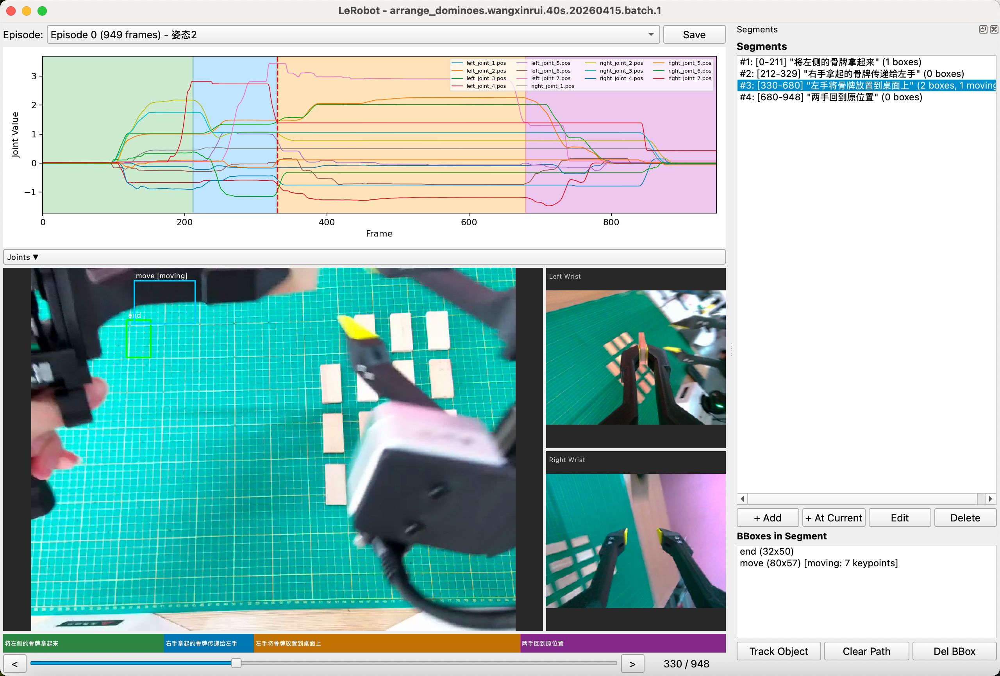
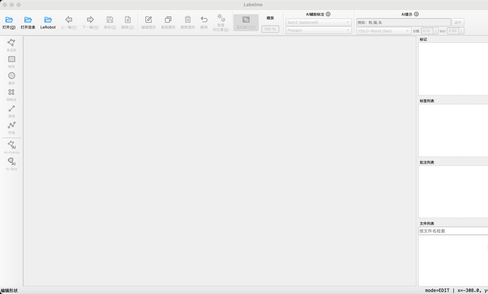

# LabelVLA

**面向 VLA 任务的标注工具**

[](https://pypi.org/project/labelvla/)
[](https://pypi.org/project/labelvla/)

[English](README.md)

<div align="center">
  
  
  <p><i>LabelVLA 标注界面</i></p>
</div>

## 为什么需要 LabelVLA？

VLA（Vision-Language-Action）是以视觉为中心的机器人操作任务范式。与传统的图像/视频标注不同，VLA 数据具有以下特点：

- **多模态时序数据**：同时包含多相机视频流、机械臂关节角度序列、末端执行器位姿等
- **以 episode 为单位**：每个 episode 是一次完整的操作过程
- **时间维度标注**：需要在时间轴上划分语义片段（segment），而非逐帧标注

目前没有一个专门面向 VLA 数据的标注工具。LabelVLA 填补了这一空白，原生支持 LeRobot v2.1 格式数据，提供以时间轴为核心的标注界面。

## 功能特性

- **LeRobot v2.1 格式原生支持** — 直接读取 parquet + mp4 数据，无需格式转换
- **多相机视图** — 同时显示头部相机（大画面）和左右腕部相机（侧边小画面）
- **关节角度曲线可视化** — 绘制所有关节角度随时间变化的曲线，支持按关节名称勾选/取消显示
- **时间轴 Segment 标注** — 在时间轴上划分片段，每个片段标注文本描述
- **目标框标注** — 在头部相机画面上画矩形框，框自动应用到同一 segment 的所有帧
- **运动物体追踪** — 对 segment 内位置变化的物体，通过在不同帧点击设置关键点，系统自动插值生成运动轨迹
- **标注结果持久化** — 以 JSON 格式保存到数据集目录下的 `segments/` 文件夹
- **远程标注模式** — `labelvla_rs` 启动 FastAPI + 浏览器前端，可以直接在无显示设备的服务器上标注数据集

## 支持的数据格式

LabelVLA 支持标准的 [LeRobot v2.1](https://github.com/huggingface/lerobot) 目录结构：

```
dataset_folder/
├── meta/
│   ├── info.json            # 数据集元信息（fps、特征定义、相机列表等）
│   ├── episodes.jsonl       # 每个 episode 的帧数
│   └── tasks.jsonl          # 任务描述
├── data/
│   └── chunk-000/
│       ├── episode_000000.parquet   # 关节角度、速度、动作等时序数据
│       ├── episode_000001.parquet
│       └── ...
└── videos/
    └── chunk-000/
        ├── observation.images.head/
        │   ├── episode_000000.mp4
        │   └── ...
        ├── observation.images.left_wrist/
        │   └── ...
        └── observation.images.right_wrist/
            └── ...
```

## 安装

### 通过 pip 安装

```bash
pip install labelvla

# 启动
labelvla
```

### 从源码安装

```bash
git clone https://github.com/Kingdroper/labelVLA.git
cd labelVLA

# 使用 uv（推荐）
uv sync
uv run labelvla

# 或使用 pip
pip install -e .
labelvla
```

### 依赖项

- Python >= 3.10
- PyQt5
- OpenCV (`opencv-python`)
- pandas + pyarrow
- matplotlib
- 其他依赖详见 `pyproject.toml`

## 快速上手

### 第一步：启动程序

```bash
labelvla
# 或
uv run labelvla
```

### 第二步：打开 LeRobot 数据集

在工具栏或 **File** 菜单中点击 **LeRobot** 按钮，选择数据集文件夹（包含 `meta/info.json` 的目录）。

### 第三步：浏览数据

打开后进入 LeRobot 标注窗口：

```
┌─────────────────────────────────────────────────┐
│ Episode: [下拉选择 ▼]                    [Save]  │
├─────────────────────────────────────────────────┤
│  关节角度曲线（支持勾选显示的关节）               │
│  点击曲线可跳转到对应帧                           │
├─────────────────────────────────────────────────┤
│  ┌──────────────────┐  ┌─────────┐              │
│  │   头部相机（大）   │  │ 左腕相机 │              │
│  │   可画标注框       │  ├─────────┤              │
│  │                    │  │ 右腕相机 │              │
│  └──────────────────┘  └─────────┘              │
├─────────────────────────────────────────────────┤
│  [seg1][    seg2    ][seg3]   时间轴             │
│  [<] ═══════════════════════════════ [>] 42/949  │
└─────────────────────────────────────────────────┘
```

- **切换帧**：拖动时间轴滑块，或按键盘 `←` `→`
- **切换 episode**：使用顶部下拉框
- **关节曲线**：点击 "Joints ▼" 展开关节选择面板，勾选需要显示的关节

### 第四步：创建 Segment

在右侧 Segments 面板：

- 点击 **"+ Add"**：手动输入起始帧、结束帧和文本描述
- 点击 **"+ At Current"**：以当前帧为起始帧快速创建

Segment 会在时间轴和关节曲线上以彩色色块显示。

### 第五步：标注目标框

1. 将时间轴拖到 segment 范围内的某一帧
2. 在头部相机大画面上**鼠标左键拖拽**画矩形框
3. 在弹出框中输入类别名称
4. 框自动应用到该 segment 的所有帧（静态物体）

### 第六步：追踪运动物体

对于 segment 内位置会变化的物体：

1. 在右侧面板选中一个 segment，再选中其中的一个 bbox
2. 点击 **"Track Object"** 进入追踪模式（按钮变橙色）
3. 用时间轴切换到不同帧，在头部相机画面上**点击物体中心位置**
4. 每次点击记录一个关键点（红点显示），相邻关键点之间自动线性插值
5. 可以每帧点击，也可以隔多帧点击——系统会自动补全中间帧
6. 按 **Esc** 或再次点击按钮退出追踪模式
7. 点击 **"Clear Path"** 可清除运动轨迹

### 第七步：保存

- 点击 **Save** 按钮或按 `Ctrl+S`
- 切换 episode 或关闭窗口时自动保存

## 远程标注（`labelvla_rs`）

如果你想在没有显示设备的服务器上标注 LeRobot 数据集，可以启动浏览器前端 + FastAPI 后端：

```bash
# 在服务器上（或本地）：
labelvla_rs --host 0.0.0.0 --port 8000 \
            --dataset /path/to/lerobot_dataset   # 可选：预加载数据集
```

然后在任意浏览器打开 `http://<服务器>:8000/`。不传 `--dataset` 时，首页会让你输入服务器端的数据集路径。

- **与桌面端完全一致** — Web UI 完整复刻了 `labelvla` 的所有功能：时间轴 segment、bbox 画框、运动物体追踪、关节曲线、快捷键（`←/→`、`Ctrl+S`、`Esc`）。
- **UE 蓝图风格** — 暗色网格背景，长时间标注不刺眼。
- **零客户端安装** — 只需要一个浏览器，标注员机器上不需要 `pip install`。
- **支持隧道** — 可以用 `ngrok`、`cloudflared` 或 SSH 隧道把端口暴露到公网，随时随地标注。
- **存储同源** — 标注写入 `{数据集}/segments/episode_NNNNNN.json`，和桌面端格式完全相同，两种入口可以互操作。

桌面端的 `labelvla` 命令保持不变，远程模式只是额外能力。

## 标注输出格式

标注结果保存在 `{数据集目录}/segments/episode_NNNNNN.json`：

```json
{
  "episode_index": 0,
  "segments": [
    {
      "start_frame": 0,
      "end_frame": 120,
      "text": "伸手抓取骨牌",
      "bboxes": [
        {
          "x": 100.0,
          "y": 200.0,
          "width": 50.0,
          "height": 50.0,
          "label": "domino",
          "keypoints": []
        },
        {
          "x": 300.0,
          "y": 150.0,
          "width": 40.0,
          "height": 40.0,
          "label": "gripper",
          "keypoints": [
            {"frame": 0, "cx": 320.0, "cy": 170.0},
            {"frame": 60, "cx": 150.0, "cy": 220.0},
            {"frame": 120, "cx": 120.0, "cy": 210.0}
          ],
          "interpolated_centers": [
            {"frame": 0, "cx": 320.0, "cy": 170.0},
            {"frame": 1, "cx": 317.2, "cy": 170.8},
            {"frame": 2, "cx": 314.3, "cy": 171.7},
            "... (每一帧一个条目，共 121 条)",
            {"frame": 120, "cx": 120.0, "cy": 210.0}
          ]
        }
      ]
    }
  ]
}
```

字段说明：

| 字段 | 说明 |
|------|------|
| `start_frame` / `end_frame` | segment 的起止帧号 |
| `text` | segment 的文本描述 |
| `bboxes[].x/y/width/height` | 矩形框的原始位置和大小 |
| `bboxes[].label` | 目标类别 |
| `bboxes[].keypoints` | 运动关键点列表（空 = 静态物体） |
| `keypoints[].frame` | 关键帧帧号 |
| `keypoints[].cx/cy` | 该帧框中心坐标 |
| `bboxes[].interpolated_centers` | 插值后每帧的框中心坐标（仅运动物体，可直接读取无需重新计算） |

## 快捷键

| 快捷键 | 功能 |
|--------|------|
| `←` / `→` | 前一帧 / 后一帧 |
| `Ctrl+S` | 保存标注 |
| `Ctrl+W` | 关闭窗口 |
| `Esc` | 退出追踪模式 |

## 致谢

LabelVLA 基于 [labelme](https://github.com/wkentaro/labelme) 构建，感谢 labelme 项目提供的基础框架。
